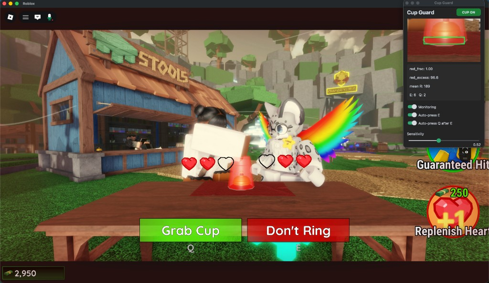

# Cup Guard

i made an entire desktop application for one (1) roblox mini-game.

that's it. that's the project.

the game is [Don't Ring the Bell! 🔔](https://www.roblox.com/share?code=33dfaa1376d41941b6b297b8a568dbd4&type=ExperienceDetails&stamp=1783032244926). you sit at a table. there's a red cup. sometimes it moves. if you react too slow you lose. i got tired of losing so i wrote screen capture code at 2am like a normal person.



## demo

one full round with cup guard running. yes i recorded myself playing roblox with a custom overlay. we all have our thing.

<video src="https://github.com/SolidifiedPlayDoh/cup-guard/raw/main/docs/demo.mp4" controls width="100%">
  <a href="https://github.com/SolidifiedPlayDoh/cup-guard/raw/main/docs/demo.mp4">watch the demo</a>
</video>

## what it does

- watches a tiny strip of pixels on the red cup rim (not the whole screen, i'm not insane)
- when the cup leaves your spot, presses **E** (don't ring)
- then presses **Q** (grab cup) after a random 2.5-4 second delay so it doesn't look like a bot wrote it (it did)
- little overlay in the top right so you can pretend you're just really good

## how to use

1. open [the game](https://www.roblox.com/share?code=33dfaa1376d41941b6b297b8a568dbd4&type=ExperienceDetails&stamp=1783032244926)
2. sit at the cup table
3. run cup guard
4. put your mouse on the **bottom rim** of the red cup
5. press **`0`**
6. green box in the preview = you're locked on. status says CUP ON. go touch grass (play the round)

press **`0`** again anytime to recalibrate. moved seats? camera weird? press 0. it's fine.

stuck? hit **Need help?** in the overlay. i included screenshots because i care about ux now apparently.

## install (from source)

you need python 3.11+ and [uv](https://docs.astral.sh/uv/) because i have standards (barely).

```bash
git clone https://github.com/SolidifiedPlayDoh/cup-guard.git
cd cup-guard
uv venv
uv pip install -e .
./run.sh
```

cli mode if you hate GUIs:

```bash
uv run cup-guard start
```

## permissions (sorry)

| platform | what it needs | why |
|----------|---------------|-----|
| macOS | Screen Recording | to look at the cup |
| macOS | Accessibility | to fake key presses |
| Windows | screen capture privacy | same deal |

give permissions to Cup Guard, or Terminal/Cursor if you're running from source. restart after. macOS will fight you on this. stay strong.

## downloads

pre-built binaries on [Releases](https://github.com/SolidifiedPlayDoh/cup-guard/releases):

- macOS: `CupGuard.app` in a zip
- Windows: `CupGuard.exe`

github actions builds them when i tag a version. fancy.

## faq

### is this against roblox TOS?

not in the "hacking" sense. it doesn't inject into roblox, read memory, or modify the client. it literally just looks at your screen and presses keys like your fingers would.

is it automation? yes. could roblox hypothetically have feelings about that? also yes. their rules are vague. use your brain.

### will i get banned

it's not an exploit. it's not a cheat engine. it's a python script with commitment issues that learned what red pixels look like.

nobody can promise you zero risk with any third party tool ever. but this is the same category as "macro keyboard" not "speed hack."

### does it work against good players

that was the whole point. high level players are fast. i am... not. cup guard watches every frame and hits E before my brain finishes forming a thought.

the Q delay is randomized on purpose so you don't press Q at the exact same millisecond every time like a robot. because you aren't a robot. cup guard is, but we don't talk about that.

### why does it sample above the cursor

because if you hover ON the red rim your mouse covers the red. then the app thinks the cup is gone. then it spams E. then you lose anyway. learned that one the hard way.

so it samples 12px above your cursor. hover the bottom rim, press 0, trust the process.

### what if screen capture is blank/white on mac

screen recording permission. system settings → privacy → screen recording → enable the app. restart cup guard. curse once quietly.

### does this work on other games

no. please no. this is tuned for one red cup in one roblox game. if you point this at league of legends i don't want to know what happens.

### can i turn off auto E or auto Q

yes. toggles in the overlay. you can also just use it as a fancy cup detector and press keys yourself like a caveman.

## overlay controls

| thing | does what |
|-------|-----------|
| Arm (0) | calibrate + start |
| Monitoring | pause/resume |
| Auto-press E | yeet E when cup moves |
| Auto-press Q | Q after E, with delay |
| Sensitivity | lower = triggers sooner |
| Need help? | pictures for confused people (me) |

## build it yourself

```bash
uv pip install pyinstaller
uv run pyinstaller CupGuard.spec --noconfirm      # macOS
uv run pyinstaller CupGuard-win.spec --noconfirm  # Windows
```

output in `dist/`. config saves to:

- macOS: `~/Library/Application Support/CupGuard/`
- Windows: `%APPDATA%\CupGuard\`

## cli commands

```bash
cup-guard              # overlay (default)
cup-guard start        # terminal mode
cup-guard calibrate    # countdown calibrate
cup-guard preview      # stats in terminal
cup-guard test-capture # "is macOS blocking me" diagnostic
```

## license

MIT. do whatever. if this gets you to champion rank please don't tell anyone i helped.
